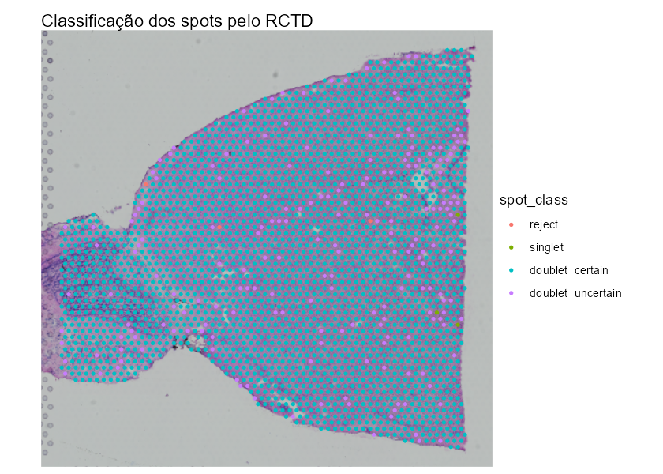
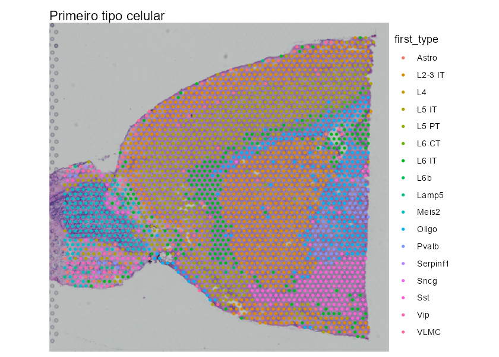
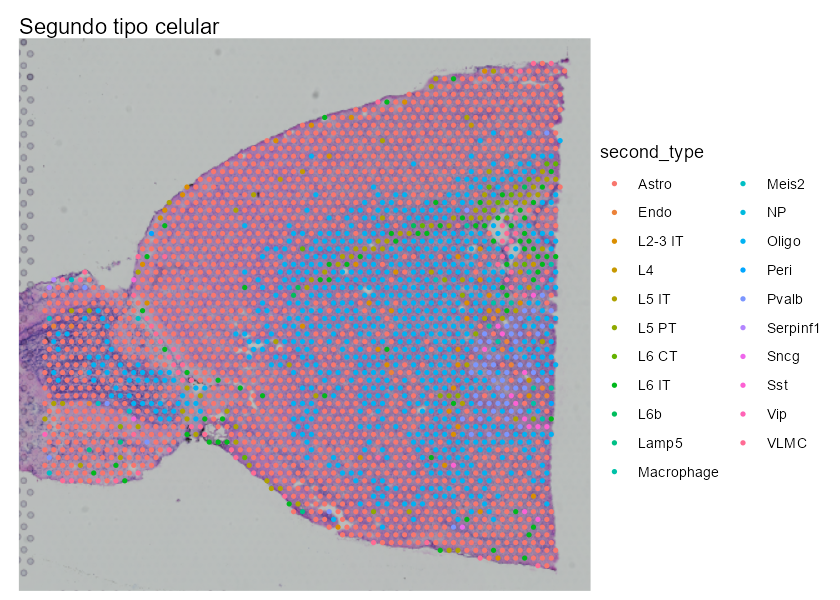
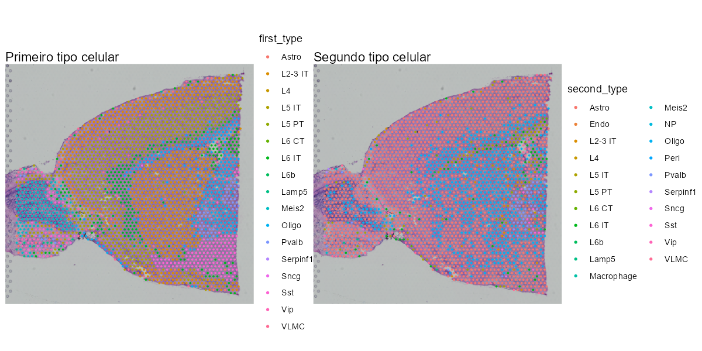

```{r configuracao, include=FALSE, purl=FALSE}
executar_analise <- if (exists("params", inherits = FALSE)) {
  isTRUE(params$run_analysis)
} else {
  # Ao executar os blocos manualmente, o objeto params não é criado.
  # Nesse caso, a análise fica habilitada por padrão.
  TRUE
}

knitr::opts_chunk$set(
  echo = TRUE,
  eval = executar_analise,
  collapse = TRUE,
  comment = "#>",
  fig.align = "center",
  fig.width = 8,
  fig.height = 6,
  message = TRUE,
  warning = FALSE
)
```

# Visão geral

Esta vinheta demonstra como estimar misturas de tipos celulares na seção anterior do cérebro de camundongo `stxBrain` com o método Robust Cell Type Decomposition (RCTD), usando a versão 2.2.1 do pacote `spacexr` disponível no GitHub [@Cable2022RCTD].

O objeto espacial será obtido diretamente pelo pacote `SeuratData`, usando a seção `anterior1` [@Hao2023Seurat]. Nenhum objeto espacial previamente processado será reutilizado. Essa separação é importante porque o RCTD modela contagens brutas de expressão e, por padrão, exige valores inteiros. Matrizes normalizadas, como as produzidas por `NormalizeData()` ou `SCTransform()`, não devem ser fornecidas como entrada do método.

Ao final do roteiro, você será capaz de:

1.  explicar por que a deconvolução requer uma referência single-cell anotada;
2.  obter do `SeuratData` as contagens brutas e as coordenadas do Visium;
3.  preparar a referência single-cell do córtex de camundongo do Allen Institute [@Tasic2016];
4.  executar o RCTD no modo `doublet`;
5.  inspecionar e visualizar as proporções estimadas; e
6.  acrescentar a anotação dominante ao objeto Seurat original.

> **Ponto essencial:** o objeto Seurat pode conter simultaneamente diferentes representações da expressão. Nesta análise será lida exclusivamente a camada `counts` do ensaio `Spatial`. A presença de uma camada normalizada no mesmo objeto não altera as contagens brutas, desde que a camada correta seja selecionada explicitamente.

# Fundamentos conceituais

Um spot do Visium é maior que uma única célula e pode capturar RNA proveniente de vários tipos celulares. O RCTD aprende perfis de expressão a partir de dados anotados de scRNA-seq ou snRNA-seq, corrige diferenças entre as plataformas da referência e da amostra espacial e estima a contribuição de cada tipo celular em cada spot [@Cable2022RCTD].

A análise possui duas entradas e uma saída principal:

| Componente | Objeto utilizado | Informação necessária |
|------------------------|------------------------|------------------------|
| Amostra espacial | `stxBrain`, seção `anterior1`, carregada por `SeuratData` | contagens brutas de genes por spots e coordenadas dos spots |
| Referência single-cell | córtex de camundongo do Allen Institute | contagens brutas de genes por células e um rótulo de tipo celular por célula |
| Resultado do RCTD | objeto da classe `RCTD` | classificação e pesos de até dois tipos celulares por spot |

O `spacexr` oferece três modos:

- `doublet`: ajusta no máximo dois tipos celulares por spot;
- `multi`: ajusta até `MAX_MULTI_TYPES` tipos celulares por spot; e
- `full`: não impõe um limite fixo ao número de tipos celulares.

Usaremos o modo `doublet`, mantendo a configuração já validada no servidor. Nesse modo, o RCTD atribui um ou dois tipos celulares a cada spot. Isso é uma simplificação do modelo e não significa que um spot Visium contenha, biologicamente, no máximo duas células ou dois tipos celulares.

# Antes de começar

## Requisitos computacionais

- R e, preferencialmente, RStudio;
- no mínimo 20 GB de memória RAM, embora uma quantidade maior seja recomendada;
- acesso à internet para a primeira instalação dos pacotes e dos dados; e
- múltiplos núcleos de CPU para reduzir o tempo de execução, quando disponíveis.

Como referência de desempenho, a execução validada para este material levou 14,22 minutos em um servidor de alta performance com 160 GB de RAM e 30 núcleos de CPU disponíveis para processamento paralelo. O tempo pode variar bastante de acordo com o equipamento, a carga do servidor e o número de tipos celulares da referência. O parâmetro `max_cores` controla o paralelismo na CPU; esta análise não utiliza aceleração por GPU.

A versão HTML desta vinheta apresenta o texto e os blocos de código, mas não executa a análise nem exibe resultados. Para gerar essa versão, use:

```{r renderizar-vinheta, eval=FALSE}
rmarkdown::render(
  "RCTD_Deconvolution_stxbrain.Rmd",
  params = list(run_analysis = FALSE)
)
```

Durante o curso, recomenda-se executar os blocos de código na ordem em que aparecem. Assim, cada objeto intermediário pode ser conferido antes de prosseguir.

## Estrutura esperada das pastas

O conjunto `stxBrain` não precisa ser copiado para o repositório. Ele será instalado pelo `SeuratData` na biblioteca de pacotes do R. O único arquivo de entrada local é `allen_cortex.rds`, que deve ficar em `data/`. Os resultados serão gravados em `resultados/`, as figuras em `imagens/` e a vinheta e o HTML permanecerão em `vinhetas/`.

``` text
Curso_ST/
|-- README.md
|-- bibliography.bib
|-- apresentacoes/
|-- data/
|   `-- allen_cortex.rds
|-- imagens/
|-- resultados/
|-- scripts/
`-- vinhetas/
    |-- RCTD_Deconvolution_stxbrain.Rmd
    `-- RCTD_Deconvolution_stxbrain.html
```

O arquivo `bibliography.bib` é compartilhado por todas as vinhetas e deve permanecer na raiz do repositório. Por isso, o cabeçalho deste documento utiliza o caminho relativo `../bibliography.bib`.

# Instalar os pacotes necessários

Execute este bloco apenas na primeira vez. Esta vinheta utiliza a versão 2.2.1 do repositório original do `spacexr` no GitHub. Essa versão usa `create.RCTD()` e `run.RCTD()` e não é intercambiável com a interface do Bioconductor.

```{r instalar-pacotes, message = FALSE, eval=FALSE}
pacotes_cran <- c(
  "Seurat", "Matrix", "ggplot2", "remotes", "knitr", "rmarkdown"
)
pacotes_cran_ausentes <- pacotes_cran[
  !vapply(pacotes_cran, requireNamespace, logical(1), quietly = TRUE)
]

if (length(pacotes_cran_ausentes) > 0) {
  install.packages(pacotes_cran_ausentes)
}

if (packageVersion("Seurat") < package_version("5.0.0")) {
  install.packages("Seurat")
}

if (!requireNamespace("SeuratData", quietly = TRUE)) {
  remotes::install_github("satijalab/seurat-data")
}

if (
  !requireNamespace("spacexr", quietly = TRUE) ||
  !exists("create.RCTD", envir = asNamespace("spacexr"), inherits = FALSE)
) {
  remotes::install_github(
    "dmcable/spacexr",
    build_vignettes = FALSE,
    upgrade = "never"
  )
}
```

Depois da instalação, reinicie a sessão do R antes de continuar. Isso evita que uma versão do `spacexr` carregada anteriormente permaneça ativa na memória.

# Informar manualmente o diretório das vinhetas

Para que cada bloco de código possa ser executado separadamente, a vinheta não tenta descobrir automaticamente onde o arquivo está salvo. Portanto, você deverá informar esse caminho uma única vez.

Siga estes passos:

1.  Abra `RCTD_Deconvolution_stxbrain.Rmd` no RStudio.
2.  Confirme que o diretório de trabalho é a pasta que contém esse arquivo. Se necessário, use o menu **Session \> Set Working Directory \> To Source File Location**.
3.  Execute `getwd()` no Console ou no pequeno bloco abaixo.
4.  O R mostrará algo semelhante a `[1] "D:/meu_curso/Curso_ST/vinhetas"`.
5.  Copie o caminho mostrado entre aspas e cole no lugar de `COLE_AQUI_O_DIRETORIO_DAS_VINHETAS` no bloco seguinte. No Windows, prefira barras `/`, como no exemplo, ou duplique cada barra invertida: `\\`.

`getwd()` apenas informa o diretório de trabalho atual. Antes de copiá-lo, confirme que essa é realmente a pasta onde está a vinheta.

```{r consultar-diretorio}
getwd()
```

Agora substitua o caminho entre aspas pelo caminho que você acabou de copiar e execute o bloco:

```{r definir-diretorios}
diretorio_vinhetas <- "COLE_AQUI_O_DIRETORIO_DAS_VINHETAS"

diretorio_vinhetas <- normalizePath(
  diretorio_vinhetas,
  winslash = "/",
  mustWork = TRUE
)

arquivo_vinheta <- file.path(
  diretorio_vinhetas,
  "RCTD_Deconvolution_stxbrain.Rmd"
)

if (!file.exists(arquivo_vinheta)) {
  stop(
    "O arquivo RCTD_Deconvolution_stxbrain.Rmd não foi encontrado em: ",
    diretorio_vinhetas,
    "\nRevise o caminho copiado de getwd()."
  )
}

diretorio_curso <- dirname(diretorio_vinhetas)
diretorio_dados <- file.path(diretorio_curso, "data")
diretorio_imagens <- file.path(diretorio_curso, "imagens")
diretorio_resultados <- file.path(diretorio_curso, "resultados")

dir.create(diretorio_dados, showWarnings = FALSE, recursive = TRUE)
dir.create(diretorio_imagens, showWarnings = FALSE, recursive = TRUE)
dir.create(diretorio_resultados, showWarnings = FALSE, recursive = TRUE)

diretorio_curso
diretorio_dados
diretorio_imagens
diretorio_resultados
```

# Carregar os pacotes

```{r carregar-pacotes}
library("Seurat")
library("SeuratData")
library("Matrix")
library("ggplot2")
library("spacexr")

options(stringsAsFactors = FALSE)

if (packageVersion("SeuratObject") < package_version("5.0.0")) {
  stop(
    "Esta vinheta requer SeuratObject 5 ou mais recente. ",
    "Execute novamente o bloco de instalação e reinicie o R."
  )
}
```

Confira a versão carregada. O resultado esperado é `2.2.1`:

```{r conferir-versao-spacexr}
packageVersion("spacexr")
```

# Obter o `stxBrain` diretamente do `SeuratData`

## Instalar o conjunto de dados

O `stxBrain` é distribuído como um pacote de dados separado. O próximo bloco verifica se esse pacote já está instalado e só faz o download quando necessário. O arquivo é relativamente grande, então a primeira instalação pode demorar alguns minutos.

```{r instalar-stxbrain}
if (requireNamespace("stxBrain.SeuratData", quietly = TRUE)) {
  message("O conjunto stxBrain já está instalado.")
} else {
  limite_tempo_anterior <- getOption("timeout")

  tryCatch(
    {
      options(timeout = max(600, limite_tempo_anterior))
      SeuratData::InstallData("stxBrain")
    },
    finally = options(timeout = limite_tempo_anterior)
  )
}
```

## Carregar a seção anterior 1

```{r carregar-stxbrain, message = FALSE}
stxbrain <- SeuratData::LoadData("stxBrain", type = "anterior1")

# O pacote de dados foi criado em uma versão anterior do Seurat. Esta
# conversão apenas atualiza a estrutura do ensaio; ela não normaliza os dados.
if (!inherits(stxbrain[["Spatial"]], "Assay5")) {
  stxbrain[["Spatial"]] <- methods::as(
    stxbrain[["Spatial"]],
    Class = "Assay5"
  )
}

stxbrain
```

## Extrair as contagens espaciais brutas

Não use a camada `data`, a camada `scale.data`, um ensaio `SCT` nem qualquer matriz previamente normalizada. O RCTD receberá apenas `Spatial/counts`.

```{r extrair-contagens-espaciais}
contagens_espaciais <- SeuratObject::LayerData(
  object = stxbrain,
  assay = "Spatial",
  layer = "counts"
)

print(paste("Número de spots:",dim(contagens_espaciais)[2]))
print(paste("Número de genes:",dim(contagens_espaciais)[1]))

contagens_espaciais[
   seq_len(min(5L, nrow(contagens_espaciais))),
   seq_len(min(5L, ncol(contagens_espaciais))),
   drop = FALSE]
```

## Examinar a profundidade de sequenciamento

O total de transcritos varia entre os spots. Este resumo ajuda a conhecer a distribuição antes da deconvolução.

```{r resumir-contagens-por-spot}
summary(Matrix::colSums(contagens_espaciais))
```

## Extrair e padronizar as coordenadas dos spots

Versões diferentes do Seurat podem retornar as coordenadas como `x`/`y` ou como `imagecol`/`imagerow`. O bloco abaixo seleciona uma dessas representações e usa os nomes esperados pelo `spacexr`.

```{r extrair-coordenadas-espaciais}
nome_imagem <- SeuratObject::Images(stxbrain)[1]
coordenadas_espaciais <- SeuratObject::GetTissueCoordinates(
  object = stxbrain,
  image = nome_imagem,
  scale = NULL
)

coordenadas_espaciais <- as.data.frame(coordenadas_espaciais)

if ("cell" %in% colnames(coordenadas_espaciais)) {
  rownames(coordenadas_espaciais) <- coordenadas_espaciais$cell
}

if (all(c("imagecol", "imagerow") %in% colnames(coordenadas_espaciais))) {
  coordenadas_espaciais <- coordenadas_espaciais[
    , c("imagecol", "imagerow"), drop = FALSE
  ]
  colnames(coordenadas_espaciais) <- c("x", "y")
} else {
  coordenadas_espaciais <- coordenadas_espaciais[
    , c("x", "y"), drop = FALSE
  ]
}

head(coordenadas_espaciais)
```

# Preparar a referência do córtex do Allen Institute

O RCTD requer uma referência de RNA-seq biologicamente adequada e anotada. Usaremos a taxonomia celular do córtex adulto de camundongo do Allen Institute, também empregada no tutorial espacial do Seurat [@Tasic2016]. Como a referência e a amostra espacial são de camundongo, os genes podem ser associados por símbolo gênico.

## Baixar a referência uma única vez

O bloco abaixo não é executado automaticamente. Se o instrutor já forneceu `data/allen_cortex.rds`, pule esta etapa. Caso contrário, execute o bloco e aguarde o término do download.

```{r baixar-referencia, eval=FALSE}
arquivo_referencia <- file.path(diretorio_dados, "allen_cortex.rds")

download.file(
  url = paste0(
    "https://www.dropbox.com/scl/fi/sgmfzk72cdoc945ap19c9/",
    "allen_cortex.rds?rlkey=qfou47stxczo14m37vmea54wl&dl=1"
  ),
  destfile = arquivo_referencia,
  mode = "wb"
)
```

## Extrair as contagens e os rótulos da referência

A referência publicada armazena os rótulos de tipos celulares na coluna `subclass`.

```{r preparar-referencia}
arquivo_referencia <- file.path(diretorio_dados, "allen_cortex.rds")

if (!file.exists(arquivo_referencia)) {
  stop(
    "A referência single-cell não foi encontrada em: ",
    arquivo_referencia,
    "\nBaixe o arquivo como descrito acima ou copie o arquivo fornecido pelo instrutor para data/."
  )
}

referencia_allen <- readRDS(arquivo_referencia)

referencia_allen <- SeuratObject::UpdateSeuratObject(referencia_allen)
metadados_referencia <- referencia_allen[[]]

if (!inherits(referencia_allen[["RNA"]], "Assay5")) {
  referencia_allen[["RNA"]] <- methods::as(
    referencia_allen[["RNA"]],
    Class = "Assay5"
  )
}

contagens_referencia <- SeuratObject::LayerData(
  object = referencia_allen,
  assay = "RNA",
  layer = "counts"
)

metadados_referencia <- metadados_referencia[
  colnames(contagens_referencia), , drop = FALSE
]

tipos_celulares_referencia <- as.character(
  metadados_referencia$subclass
)
tipos_celulares_referencia <- gsub(
  "/", "-", tipos_celulares_referencia, fixed = TRUE
)

celulas_validas <- !is.na(tipos_celulares_referencia) &
  nzchar(tipos_celulares_referencia)

tamanhos_tipos <- table(tipos_celulares_referencia[celulas_validas])
tipos_elegiveis <- names(tamanhos_tipos[tamanhos_tipos >= 25])
celulas_validas <- celulas_validas &
  tipos_celulares_referencia %in% tipos_elegiveis

contagens_referencia <- contagens_referencia[
  , celulas_validas, drop = FALSE
]
tipos_celulares_referencia <- droplevels(
  factor(tipos_celulares_referencia[celulas_validas])
)

data.frame(
  celulas_referencia = ncol(contagens_referencia),
  tipos_celulares_retidos = nlevels(tipos_celulares_referencia),
  coluna_de_rotulo = "subclass"
)
```

O filtro padrão do RCTD exige pelo menos 25 células por tipo celular. Os tipos raros são removidos explicitamente acima, evitando que desapareçam de forma silenciosa durante o pré-processamento.

## Identificar genes compartilhados

```{r identificar-genes-comuns}
genes_comuns <- intersect(
  rownames(contagens_espaciais),
  rownames(contagens_referencia)
)

resumo_genes <- data.frame(
  fonte = c("amostra espacial", "referência single-cell", "interseção"),
  numero_de_genes = c(
    nrow(contagens_espaciais),
    nrow(contagens_referencia),
    length(genes_comuns)
  )
)
resumo_genes

if (length(genes_comuns) < 1000L) {
  stop(
    "Foram encontrados menos de 1.000 genes compartilhados. Verifique o organismo, ",
    "os identificadores gênicos e se ambas as matrizes contêm contagens brutas."
  )
}

contagens_espaciais <- contagens_espaciais[
  genes_comuns, , drop = FALSE
]
contagens_referencia <- contagens_referencia[
  genes_comuns, , drop = FALSE
]

rm(resumo_genes, referencia_allen)
invisible(gc())
```

# Construir os objetos de entrada do `spacexr`

A versão do GitHub recebe a referência em um objeto `Reference` e a amostra espacial em um objeto `SpatialRNA`.

```{r construir-objetos-entrada}
names(tipos_celulares_referencia) <- colnames(contagens_referencia)

referencia_rctd <- spacexr::Reference(
  contagens_referencia,
  tipos_celulares_referencia,
  Matrix::colSums(contagens_referencia)
)

consulta_rctd <- spacexr::SpatialRNA(
  as.data.frame(coordenadas_espaciais),
  contagens_espaciais,
  Matrix::colSums(contagens_espaciais)
)

head(referencia_rctd)
head(consulta_rctd)

rm(
  contagens_espaciais,
  contagens_referencia,
  coordenadas_espaciais,
  metadados_referencia,
  tipos_celulares_referencia,
  genes_comuns
)
invisible(gc())
```

# Executar o RCTD

## Criar o objeto RCTD

`create.RCTD()` prepara os dados, seleciona genes informativos e aprende os perfis dos tipos celulares da referência. O servidor utilizado no curso possui 30 núcleos de CPU; o código reserva dois para o sistema e utiliza 28 na análise. Em outro computador, ajuste `numero_nucleos` para um valor adequado à máquina disponível.

```{r criar-rctd}
set.seed(20260904)

numero_nucleos <- 28

RCTD <- spacexr::create.RCTD(
  consulta_rctd,
  referencia_rctd,
  max_cores = numero_nucleos
)

rm(consulta_rctd, referencia_rctd)
invisible(gc())
```

## Executar a deconvolução

O modo `doublet` procura um ou dois tipos celulares por spot. O tempo de execução varia de acordo com o servidor e o número de células da referência.

```{r executar-rctd,message = FALSE}
inicio_rctd <- Sys.time()

RCTD <- spacexr::run.RCTD(
  RCTD,
  doublet_mode = "doublet"
)

fim_rctd <- Sys.time()
tempo_rctd <- fim_rctd - inicio_rctd
tempo_rctd

saveRDS(
  RCTD,
  file = file.path(
    diretorio_resultados,
    "stxbrain_RCTD_doublet_results.rds"
  )
)

rm(inicio_rctd, fim_rctd, tempo_rctd, numero_nucleos)
invisible(gc())
```

# Inspecionar o resultado do RCTD

No modo `doublet`, os resultados principais ficam em dois componentes do objeto `RCTD`:

- `results_df`: classificação do spot e tipos celulares atribuídos;
- `weights_doublet`: pesos associados ao primeiro e ao segundo tipo.

```{r inspecionar-pesos}
resultado_spots <- RCTD@results$results_df
pesos_doublet <- as.data.frame(RCTD@results$weights_doublet)
colnames(pesos_doublet) <- c("peso_primeiro_tipo", "peso_segundo_tipo")

resumo_spots_rctd <- cbind(resultado_spots, pesos_doublet)

head(resumo_spots_rctd)
table(resumo_spots_rctd$spot_class)
```

As classes produzidas pelo RCTD são:

- `singlet`: um tipo celular foi atribuído com confiança;
- `doublet_certain`: dois tipos celulares foram atribuídos com confiança;
- `doublet_uncertain`: somente o primeiro tipo é confiável; e
- `reject`: o método não produziu uma atribuição confiável.

# Acrescentar as anotações ao objeto Seurat

Vamos acrescentar a tabela do RCTD ao metadado do `stxbrain`. O Seurat utiliza os códigos de barras presentes nos nomes das linhas para posicionar cada resultado no spot correto.

```{r anotar-seurat}
stxbrain <- SeuratObject::AddMetaData(
  object = stxbrain,
  metadata = resumo_spots_rctd
)

rm(RCTD, resultado_spots, pesos_doublet)
invisible(gc())
```

# Visualizar as classificações no tecido

Primeiro, observe onde o RCTD identificou `singlet`, `doublet_certain`, `doublet_uncertain` ou `reject`. Ao executar os blocos manualmente, todas as figuras serão salvas como PNG em `imagens/`, com resolução moderada de 120 dpi.

```{r visualizar-classes-rctd}
p_classes <- Seurat::SpatialDimPlot(
  object = stxbrain_Seurat_com_RCTD,
  images = nome_imagem,
  group.by = "spot_class",
  pt.size.factor = 1.6,
  crop = TRUE
) +
  labs(title = "Classificação dos spots pelo RCTD")

p_classes

ggplot2::ggsave(
  filename = file.path(
    diretorio_imagens,
    "rctd_classificacao_spots.png"
  ),
  plot = p_classes,
  width = 7,
  height = 5,
  units = "in",
  dpi = 120,
  bg = "white"
)

rm(p_classes)
invisible(gc())
```

A figura abaixo foi produzida durante a execução manual validada da vinheta e é apresentada aqui como exemplo. Ela é incorporada ao HTML a partir do arquivo PNG já salvo, sem executar novamente o código.

{width=85%}

Em seguida, visualize o primeiro e o segundo tipo celular atribuídos. O segundo tipo deve ser interpretado somente junto com `spot_class`: ele é confiável quando o spot foi classificado como `doublet_certain`.

```{r visualizar-tipos-rctd, fig.width=12, fig.height=6}
p1 <- Seurat::SpatialDimPlot(
  object = stxbrain_Seurat_com_RCTD,
  images = nome_imagem,
  group.by = "first_type",
  pt.size.factor = 1.6,
  crop = TRUE
) +
  labs(title = "Primeiro tipo celular")

p2 <- Seurat::SpatialDimPlot(
  object = stxbrain_Seurat_com_RCTD,
  images = nome_imagem,
  group.by = "second_type",
  pt.size.factor = 1.6,
  crop = TRUE
) +
  labs(title = "Segundo tipo celular")

p_tipos <- p1 + p2
p_tipos

ggplot2::ggsave(
  filename = file.path(
    diretorio_imagens,
    "rctd_primeiro_tipo_celular.png"
  ),
  plot = p1,
  width = 7,
  height = 5,
  units = "in",
  dpi = 120,
  bg = "white"
)

ggplot2::ggsave(
  filename = file.path(
    diretorio_imagens,
    "rctd_segundo_tipo_celular.png"
  ),
  plot = p2,
  width = 7,
  height = 5,
  units = "in",
  dpi = 120,
  bg = "white"
)

ggplot2::ggsave(
  filename = file.path(
    diretorio_imagens,
    "rctd_tipos_celulares_combinados.png"
  ),
  plot = p_tipos,
  width = 10,
  height = 5,
  units = "in",
  dpi = 120,
  bg = "white"
)

rm(p1, p2, p_tipos)
invisible(gc())
```

Os mapas individuais permitem examinar com mais detalhe a distribuição espacial de cada atribuição.

{width=85%}

{width=85%}

O painel combinado facilita a comparação direta entre o primeiro e o segundo tipo celular.

{width=100%}

# Salvar os resultados reutilizáveis

```{r salvar-resultados}
write.csv(
  resumo_spots_rctd,
  file = file.path(
    diretorio_resultados,
    "stxbrain_RCTD_doublet_spot_summary.csv"
  ),
  row.names = TRUE
)

saveRDS(
  stxbrain,
  file = file.path(
    diretorio_resultados,
    "stxbrain_Seurat_com_RCTD.rds"
  )
)
```

Os arquivos possuem finalidades complementares:

- `stxbrain_RCTD_doublet_results.rds`: objeto completo produzido pelo RCTD;
- `stxbrain_RCTD_doublet_spot_summary.csv`: classificação, primeiro e segundo tipos celulares e seus pesos por spot; e
- `stxbrain_Seurat_com_RCTD.rds`: objeto Seurat com os resultados do RCTD no metadado.

As figuras `rctd_classificacao_spots.png`, `rctd_primeiro_tipo_celular.png`, `rctd_segundo_tipo_celular.png` e `rctd_tipos_celulares_combinados.png` serão gravadas em `imagens/`.

# Lista de verificação para interpretação

Antes de formular conclusões biológicas, verifique:

1.  **Qual foi a classificação do spot?** Não interprete spots classificados como `reject` como atribuições confiáveis.
2.  **O segundo tipo é confiável?** Em `doublet_uncertain`, somente o primeiro tipo deve ser tratado como confiável.
3.  **A referência é adequada?** A referência do Allen Institute enfatiza populações corticais; tipos ausentes da referência não podem ser descobertos pelo RCTD.
4.  **As previsões são espacialmente plausíveis?** Populações esperadas no córtex e na substância branca devem formar padrões anatômicos coerentes, em vez de pontos dispersos aleatoriamente.

As atribuições e os pesos do RCTD são estimativas baseadas em um modelo. Eles não correspondem diretamente ao número de células presentes no spot.

# Informações da sessão

```{r informacoes-sessao}
sessionInfo()
```

# Referências
